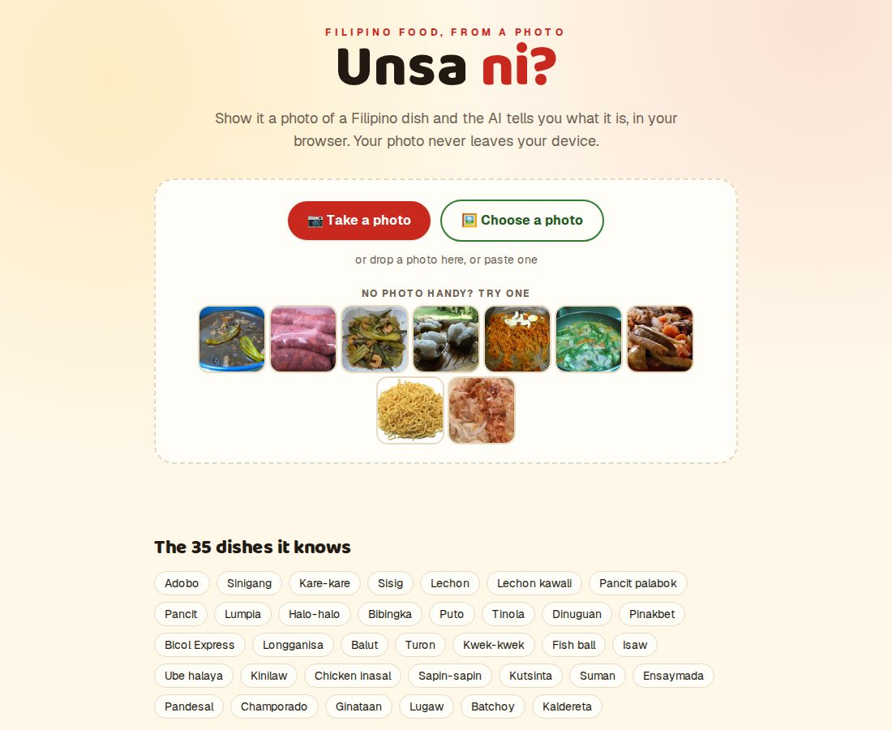
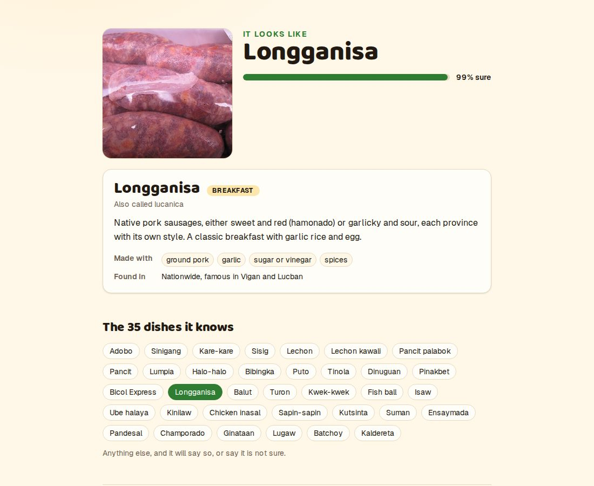
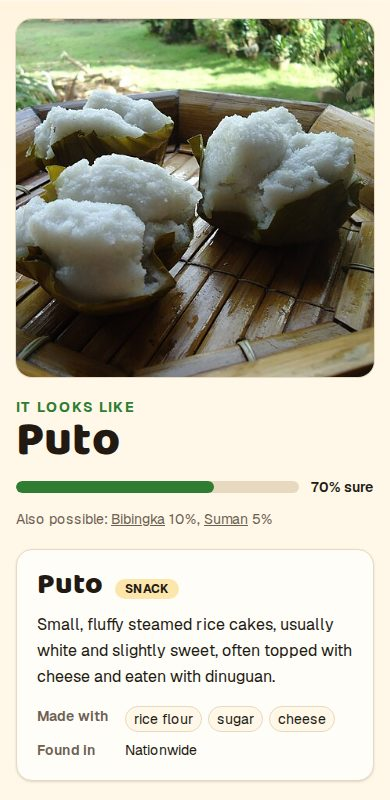
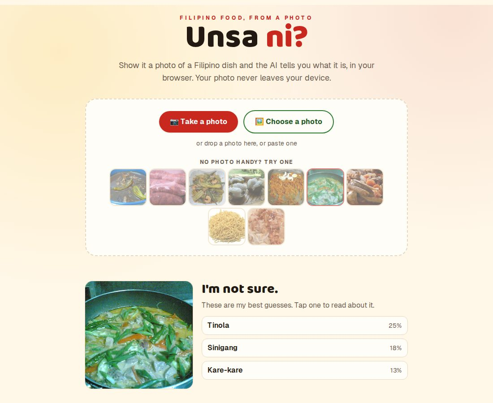

# Unsa Ni?

**Point it at a Filipino dish and it tells you what it is.** *Unsa ni?* is Bisaya for "what is this?". Take a photo of adobo, sinigang, halo-halo or 32 other dishes and the AI names it, says how sure it is, and tells you a little about the dish. It also says so when something is *not* a Filipino dish, or when it isn't sure.

The AI runs **in your browser**. The photo is never uploaded, and there is no server or API key. It is also an **installable app (a PWA)**, and once you have used it online one time it **works with no internet at all**, because the AI is on your device.

| Home | It knows this one | On a phone |
| --- | --- | --- |
|  |  |  |

And when it isn't sure, it says so and shows its best guesses:



## How it works

1. **CLIP** (OpenAI's image-and-text model, run in the browser with [transformers.js](https://huggingface.co/docs/transformers.js), about 85 MB, downloaded on the first photo and then cached) turns a photo into 512 numbers that describe what is in it.
2. **A small classifier I trained** turns those numbers into a dish. It starts from CLIP's own zero-shot guess (matching the photo against sentences like "adobo: dark brown pieces of braised meat in a glossy soy and vinegar sauce") and is then nudged by about 500 real photos of the dishes (695 candidates, minus the mislabelled ones), with a penalty that stops it wandering far from that start. It is 134 KB.
3. **It has a 36th class, "other".** It was taught with photos of other foods (pizza, sushi, salads, cakes...) and of things that aren't food (cats, cars, people, landscapes), so that a pizza gets "that doesn't look like a Filipino dish" instead of a confident wrong answer.
4. **It knows when to hold back.** The score is calibrated, and below 40% confidence the app says "I'm not sure" and shows its top three guesses instead of naming a dish.

The photos come from [Wikimedia Commons](https://commons.wikimedia.org): 1,751 freely licensed photos by 713 photographers, credited in [`data/images.json`](data/images.json). The dish descriptions are in [`data/dishes.json`](data/dishes.json).

## How good is it?

`npm run eval` runs the exact files the app ships (`public/model/probe.json` and `lib/classify.ts`) over test photos that were never used for training or for choosing the training settings (see the caveats below).

**Filipino dish photos** (151 photos, 56 photographers):

| | |
| --- | --- |
| The right dish is its top guess | **75%** |
| The right dish is in its top 3 | **90%** |
| What the app says | names a dish for **82%** of photos, and is **right 79%** of those; "not sure" for 13% (the right dish is in its three guesses 80% of those times); "not a dish" for 5% |

For comparison, CLIP with no training at all (just the sentences) gets 51% top-1 and 81% top-3, and chance is 3%.

**Photos that are not a Filipino dish** (132 photos: other foods, animals, cars, people, landscapes): **81%** get "not a dish", 10% "not sure", and **9%** are wrongly named as a Filipino dish.

**In a real browser** (`eval/browser-eval.mjs` pushes the same 283 photos through the running app): dish photos are named 83% of the time and right 77% of those; 78% of non-dish photos are recognised. The browser gives the same answer as Node on 94% of photos.

What the numbers do and don't say, plainly:

- **The test set is easier than the real world.** Wikimedia's dish categories are full of things that aren't the dish (a sign, a table of nutrition facts, a stage show that shares a name, raw ingredients). I looked at all 250 candidate test photos and left out the 99 that were wrong or too ambiguous to call ([`data/reviewed-out.json`](data/reviewed-out.json)). That makes the labels trustworthy, but it also removed the hardest photos. A blurry phone photo taken at night will do worse.
- **It is a small test.** 151 dish photos means each percentage is uncertain by roughly ±7 points, and most dishes have only 1 to 11 test photos, so I don't report per-dish accuracy as a number to trust. The weakest, by the little there is: ginataan 0/5, kwek-kwek 2/4, sinigang 6/11.
- **The mix-ups make sense**: sinigang is called tinola (5 times, both clear soups), ginataan is called lugaw (4 times, both pale porridges), palabok is called pancit.
- **The photographers are kept apart.** Photos are split into train, validation and test by *photographer*, not at random, because the same person's photos of the same plate would let the test just measure memory. A test checks this ([`lib/data.test.ts`](lib/data.test.ts)).
- **I looked at the test numbers several times** while building this (adding the "other" class, fixing the preprocessing), so they are a little friendlier than a single untouched look would be. The training settings and the "other" bias were chosen on the validation photos, but the 40% confidence line for "I'm not sure" I picked after looking at a table of test results for 30% to 70%, so that one is not clean.
- I have **not** tried it on real phone photos or on Safari. The photos are from Wikipedia contributors, mostly taken in good light.

### Problems the measuring found

- **Noisy labels.** About 40% of the raw test candidates were not a photo of the dish. Training photos are noisy too, so they are filtered: a dish photo is kept for training only if CLIP's own guess puts its label in the top 5.
- **Nothing to say for non-food.** A model that has only ever seen dishes will call a cat a dish. That is why there is an "other" class.
- **Training and the app saw different pixels.** The first version was trained on vectors made in Node and served in the browser, whose canvas shrinks a photo slightly differently. Overall accuracy looked fine, but the *same photo* got a different answer 19% of the time. Now one small file, [`lib/preprocess.ts`](lib/preprocess.ts), prepares photos in both places; the disagreement fell to 6%.

## Run it

```bash
npm install
npm run dev          # http://localhost:3000
```

The model file and data are committed, so that is all you need. To rebuild everything:

```bash
npm run data:collect   # download the photos from Wikimedia Commons (about 1,750, into .cache/)
npm run data:embed     # turn every photo into CLIP numbers
npm run train          # train the classifier, pick its settings on validation, write public/model/probe.json
npm run eval           # the numbers above
```

```bash
npm test               # 23 tests: the preprocessing, the decision logic, the data (no leakage, real licences), the offline cache list
npm run typecheck && npm run lint
```

`data:collect` splits the photos by photographer and cannot reproduce my eye review of the test photos, so `data/reviewed-out.json` and `data/images.json` are committed as they are.

## How it's built

```
app/components/    Lens (the page), DishInfo, RegisterSW
app/manifest.ts    the web app manifest (name, icons, colours)
public/sw.js       the service worker that makes it work offline
lib/
  classify.ts      photo numbers -> "answered" / "not sure" / "not a dish" (used by the app AND the eval)
  preprocess.ts    shrink and crop a photo the same way in training and in the browser
  vision.worker.ts CLIP's image model in a Web Worker
  useVision.ts     starts it on first use, reports the download
  prompts.ts       the sentences CLIP compares a photo against
scripts/           collect-images, embed-photos, train-probe
eval/              dish-accuracy (Node), browser-eval (real browser)
data/              dishes.json, images.json (credits), reviewed-out.json
public/model/      probe.json, the trained classifier
```

Next.js 16 (App Router), TypeScript, Tailwind 4.

## Limits

- It knows **35 dishes**. Anything else it will call "not sure" or "not a dish", or, about 9% of the time for things that aren't Filipino dishes, name one wrongly.
- It sees a **centre square** of the photo (that is how CLIP works), so a dish at the edge of a wide photo can be cut off.
- The **first photo downloads about 85 MB** (then it is cached), and takes 10 to 20 seconds on a good connection. After that a photo takes under a second.
- **Offline needs one online use first**: the page, the AI (about 85 MB) and its runtime are cached the first time you take a photo. A browser can clear cached data when a phone is short of space, and then the AI downloads again. I tested offline in Chromium (page reload and a photo, with the network switched off), not on a real phone or in Safari.
- The dish descriptions are short and general; regional versions vary a lot.
- Some dishes had few usable photos (a handful of photographers), so the model may know them less well.

## Credits

The nine sample photos in `public/samples` are by their photographers, under the licences listed in the app footer and on their Commons pages. All 1,751 photos used to build and test the model are credited in [`data/images.json`](data/images.json) (title, photographer, licence, link); only the nine samples are redistributed here. [CLIP](https://github.com/openai/CLIP) is by OpenAI (MIT licence); the ONNX version is from [Xenova/clip-vit-base-patch32](https://huggingface.co/Xenova/clip-vit-base-patch32).
